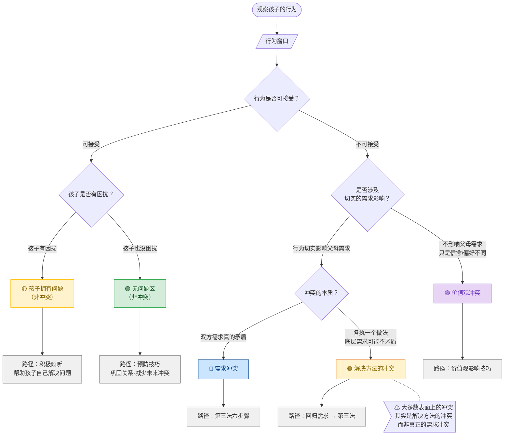
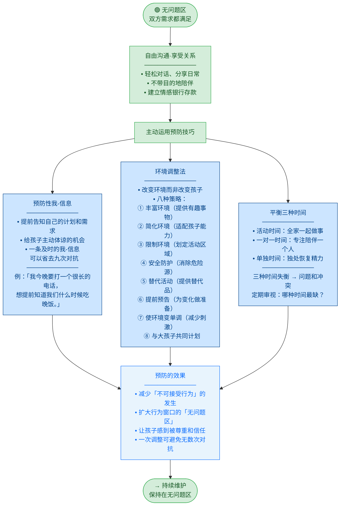
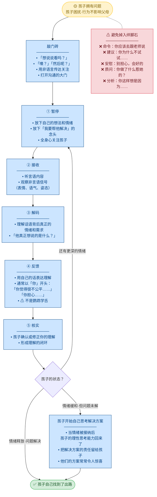
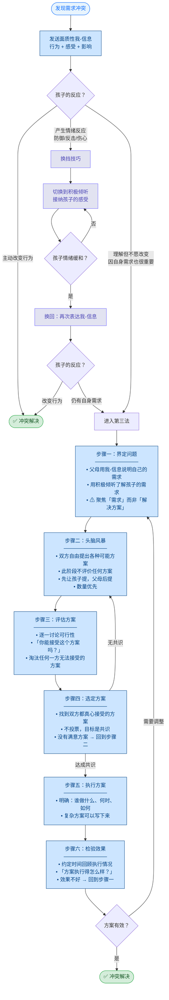
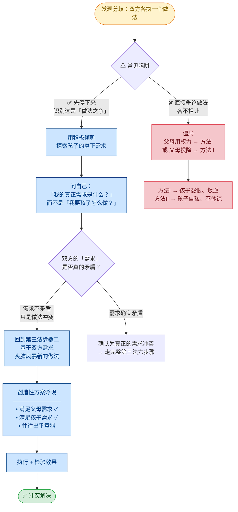
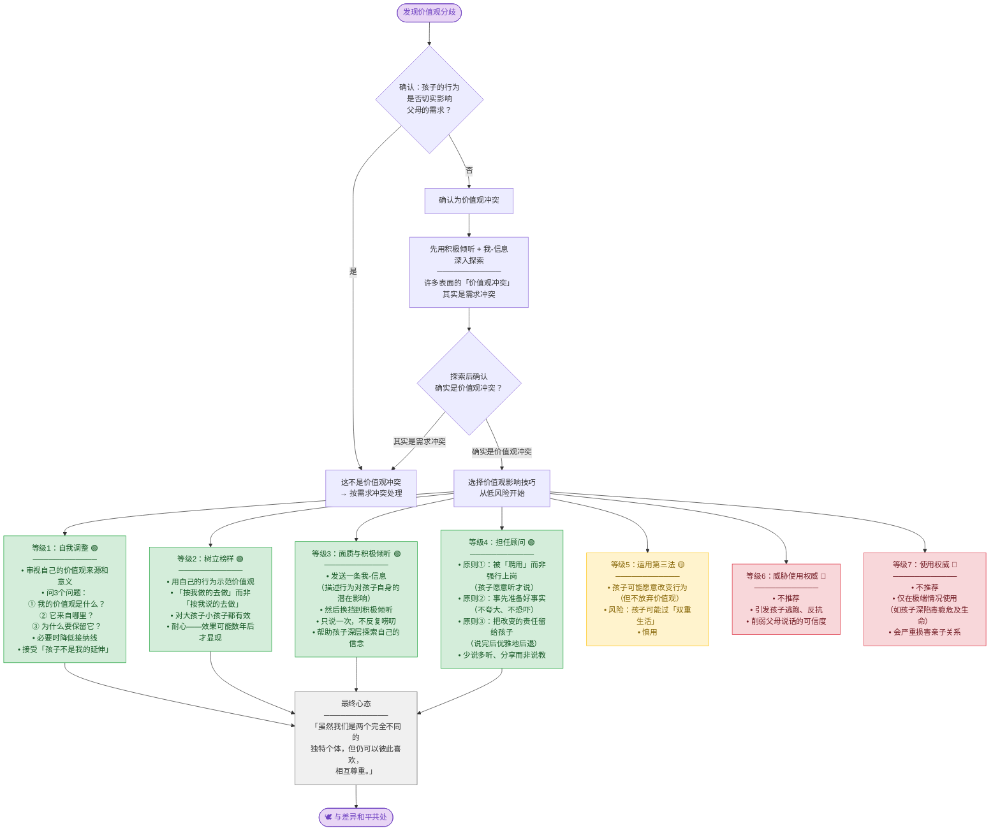
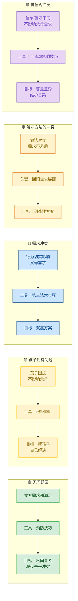

# PET 亲子沟通完整流程

## 总览：行为窗口 → 五种情境

PET 的起点是**行为窗口**。父母观察孩子的行为后，判断落入哪个区域，每个区域对应不同的应对路径。其中**两种是非冲突情境**，**三种是冲突情境**。



---

## 一、无问题区 → 预防与关系巩固

**定义**：孩子的行为可接受，孩子自身也没有困扰，双方需求都被满足，关系处于和谐状态。

**核心目标**：这是 PET 最理想的区域。P.E.T. 的终极目标就是**扩大这个区域**。此时不需要"解决问题"，而是**享受关系**，同时主动运用**预防技巧**，减少未来冲突的发生。



### 关键洞见

- 无问题区不是"什么都不用做"的区域——它是**主动投资关系**的最佳时机
- 预防的成本远低于事后解决冲突的成本
- 环境调整是**最被忽视**的预防手段——一次布置可以避免反复对抗

> **类比**：如果你年迈的父母因半身不遂需要住进你家，你会毫不犹豫地铺防滑垫、装扶手、移走小地毯。那为什么不为孩子做同样的事？

---

## 二、孩子拥有问题 → 积极倾听

**定义**：孩子的行为可接受，但**孩子自身**不高兴、沮丧、困惑、受伤。问题属于孩子，不属于父母。

**核心工具**：积极倾听（Active Listening）——反映孩子的情绪和需求，帮助孩子**自己**解决问题。

**核心态度**：信任孩子有能力处理自己的问题；不替孩子解决，不给建议，不评判。



### 积极倾听的五大功效

1. **帮助释放情绪**——被鼓励坦诚说出困扰时，情绪会奇迹般地消失
2. **减少对负面情绪的恐惧**——传达"情绪是友好的"
3. **促进温暖的亲子关系**——被倾听和理解带给人极大的满足感
4. **帮助孩子自己解决问题**——"说出来"比"在心里想"更容易找到出路
5. **使孩子更愿意倾听父母**——被倾听的人更容易反过来倾听对方

### 必备态度（缺一不可）

| 态度 | 说明 |
|---|---|
| 真心想听 | 如果没时间，实话实说，不要假装 |
| 真诚希望帮助 | 而非急于展示你的解决方案 |
| 接受孩子的情绪 | 不论它们是什么——愤怒、悲伤、嫉妒 |
| 信任孩子的能力 | 相信他能处理自己的问题 |
| 认识到情绪是暂时的 | 不必害怕，它会流过去 |
| 视孩子为独立个体 | 他不是你的延伸 |

> **最常见的错误**：打开门后又关上——先积极倾听了两句，中途忍不住掉进12种沟通绊脚石（开始建议、评判、说教……）。

---

## 三、需求冲突的解决流程

**定义**：一方的行为**切实、具体地影响**了另一方满足自身需求。例如：孩子把音乐开到震天响，父母无法休息。

**核心工具**：第三法（没有输家的冲突解决）

**前置条件**：面质性我-信息和积极倾听都无法自然化解时，进入第三法。



### 第三法的五大优势

1. **孩子有动力执行**——参与制定的决策，执行意愿远高于被强加的
2. **更高质量的方案**——两个脑袋比一个好，常产出意想不到的创造性方案
3. **培养思考能力**——孩子在参与中练习分析和解决问题
4. **更少敌意，更多爱**——共同解决问题拉近关系
5. **几乎不需要强制执行**——孩子既然同意了，通常自觉执行

---

## 四、解决方法的冲突

**定义**：表面上双方各执一个做法（你坚持 A，孩子坚持 B），但**底层需求可以同时满足**。戈登指出，亲子之间的大多数冲突其实是解决方法的冲突，而非真正的需求冲突。

**经典案例**：

| | 表面的解决方法 | 真正的需求 |
|---|---|---|
| 父亲 | 简**必须穿**雨衣 | 简不要被淋湿、不要感冒 |
| 简 | **不穿**雨衣 | 不想穿难看的衣服在同学面前丢脸 |

两个做法冲突了，但两个需求完全可以同时满足——借妈妈那件好看的旧雨衣。



### 关键口诀

> **分清「需求」和「做法」，是打开死锁的钥匙。**
>
> 当你发现自己在想"孩子必须……"时，问一句：**"我真正需要的是什么？"**

---

## 五、价值观冲突的解决流程

**定义**：分歧涉及孩子的信念、价值观、风格、偏好或生活态度，但孩子的行为**没有切实影响**父母满足自身需求。

**判断**：问自己——"孩子的行为有没有**直接、具体地**影响到我？"如果没有，多半是价值观冲突。

**核心原则**：不使用第三法（孩子不愿把价值观摆上谈判桌），也绝不使用权力。用**价值观影响技巧**。

PET 归纳了 7 个等级的应对方式，**从低风险到高风险**排列。推荐使用等级 1~4（绿色区），慎用等级 5（黄色区），不推荐等级 6~7（红色区）。



### 价值观冲突的常见领域

| 领域 | 典型表现 |
|---|---|
| 外表 | 发型、着装、文身、穿环 |
| 社交 | 交友选择 |
| 娱乐 | 音乐/影视偏好 |
| 信仰 | 宗教观、道德观 |
| 学业 | 学习态度、读书选择 |
| 生活 | 饮食习惯、性观念、职业选择 |

### 孩子的典型回应（说明这是价值观冲突）

- "这是**我的**头发。"
- "别管我的事。"
- "这又没碍**你**的事。"
- "我有权做我喜欢的。"

---

## 六、五种情境对比总结



| | 🟢 无问题区 | 🟡 孩子拥有问题 | 🔵 需求冲突 | 🟠 解决方法的冲突 | 🟣 价值观冲突 |
|---|---|---|---|---|---|
| **本质** | 双方需求都满足 | 孩子困扰，不影响父母 | 双方需求真的矛盾 | 做法对立，需求可共存 | 信念/偏好不同 |
| **问题归属** | 无问题 | 孩子 | 双方 | 双方 | 无（或父母自认的） |
| **核心工具** | 预防性我-信息、环境调整、三种时间 | 积极倾听五步法 | 第三法六步骤 | 回归需求 + 第三法 | 价值观影响技巧 |
| **父母角色** | 同伴、预防者 | 倾听者、帮助者 | 协商者 | 需求探索者 | 咨询者、榜样 |
| **目标** | 巩固关系、防患未然 | 帮孩子自己找到出路 | 双赢方案 | 满足双方需求的新做法 | 尊重差异，维护关系 |
| **禁忌** | 忽视这个区域（不投资关系） | 替孩子解决、给建议、评判 | 方法I或方法II | 在做法层面僵持不下 | 用权力或第三法强改价值观 |

### PET 的终极目标

```
┌──────────────────────────────┐
│  孩子拥有问题  →  积极倾听     │ ↑ 缩小
├──────────────────────────────┤
│                              │
│        没 有 问 题            │ ← 扩大这个区域！
│                              │
├──────────────────────────────┤
│  父母拥有问题  →  我-信息/第三法│ ↓ 缩小
└──────────────────────────────┘
```

> **一句话总结**：先通过行为窗口判断情境，再选择对应的工具。无问题时主动预防；孩子有困扰时倾听而不替他解决；有冲突时分清冲突类型再行动。用错工具比不用工具更危险——拿第三法去改变价值观，或拿权力去解决需求冲突，都会适得其反。
