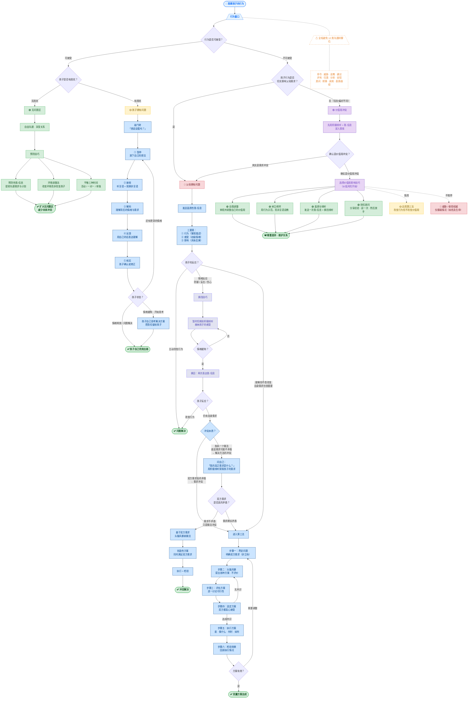

# PET 父母效能训练 · 完整 SOP 流程图

```mermaid
flowchart TD
    %% ════════════════ 入口 ════════════════
    START(["👀 观察孩子的行为"]) --> BW[/"行为窗口"\]
    BW --> D1{"行为是否可接受？"}

    %% ════════════════ 可接受分支 ════════════════
    D1 -->|"可接受"| D2{"孩子是否有困扰？"}

    D2 -->|"无困扰"| ZONE_G["🟢 无问题区"]
    D2 -->|"有困扰"| ZONE_Y["🟡 孩子拥有问题"]

    %% ════════════════ 不可接受分支 ════════════════
    D1 -->|"不可接受"| D3{"孩子行为是否\n切实影响父母需求？"}

    D3 -->|"是"| ZONE_R["🔴 父母拥有问题"]
    D3 -->|"否（信念/偏好不同）"| ZONE_P["🟣 价值观冲突"]

    %% ═══════════════════════════════════════
    %% 🟢 无问题区
    %% ═══════════════════════════════════════
    ZONE_G --> ENJOY["自由沟通 · 享受关系"]
    ENJOY --> PREV["预防技巧"]
    PREV --> PREV1["预防性我-信息\n提前沟通需求与计划"]
    PREV --> PREV2["环境调整法\n改变环境而非改变孩子"]
    PREV --> PREV3["平衡三种时间\n活动 / 一对一 / 单独"]
    PREV1 & PREV2 & PREV3 --> KEEP(["✅ 扩大无问题区\n减少未来冲突"])

    %% ═══════════════════════════════════════
    %% 🟡 孩子拥有问题 → 积极倾听
    %% ═══════════════════════════════════════
    ZONE_Y --> DOOR["敲门砖\n「想说说看吗？」"]
    DOOR --> AL1["① 暂停\n放下自己的想法"]
    AL1 --> AL2["② 接收\n听言语 + 观察非言语"]
    AL2 --> AL3["③ 解码\n理解背后的情绪与需求"]
    AL3 --> AL4["④ 反馈\n用自己的话表达理解"]
    AL4 --> AL5["⑤ 核实\n孩子确认或修正"]
    AL5 --> D_AL{"孩子状态？"}
    D_AL -->|"情绪释放 / 问题解决"| AL_OK(["✅ 孩子自己找到出路"])
    D_AL -->|"还有更深的情绪"| AL1
    D_AL -->|"情绪缓和 · 开始思考"| CHILD_SOLVE["孩子自己思考解决方案\n把责任留给孩子"]
    CHILD_SOLVE --> AL_OK

    %% ═══════════════════════════════════════
    %% 🔴 父母拥有问题 → 我-信息 → 第三法
    %% ═══════════════════════════════════════
    ZONE_R --> IM["发送面质性我-信息"]
    IM --> IM_D["三要素：\n① 行为（客观描述）\n② 感受（初级情绪）\n③ 影响（具体后果）"]
    IM_D --> D_IM{"孩子的反应？"}

    D_IM -->|"主动改变行为"| IM_OK(["✅ 问题解决"])
    D_IM -->|"情绪反应\n防御 / 反击 / 伤心"| SHIFT["换挡技巧"]
    D_IM -->|"理解但不愿改变\n自身需求也很重要"| M3["进入第三法"]

    %% ── 换挡 ──
    SHIFT --> SHIFT_AL["暂时切换到积极倾听\n接纳孩子的感受"]
    SHIFT_AL --> D_SHIFT{"情绪缓和？"}
    D_SHIFT -->|"否"| SHIFT_AL
    D_SHIFT -->|"是"| SHIFT_BACK["换回：再次表达我-信息"]
    SHIFT_BACK --> D_SHIFT2{"孩子反应？"}
    D_SHIFT2 -->|"改变行为"| IM_OK
    D_SHIFT2 -->|"仍有自身需求"| D_TYPE

    %% ── 判断冲突类型 ──
    D_TYPE{"冲突本质？"}
    D_TYPE -->|"双方需求真的矛盾\n→ 需求冲突"| M3
    D_TYPE -->|"各执一个做法\n底层需求可能不矛盾\n→ 解决方法的冲突"| SOL_Q

    %% ── 解决方法的冲突 ──
    SOL_Q["问自己：\n「我的真正需求是什么？」\n用积极倾听探索孩子的需求"]
    SOL_Q --> D_SOL{"双方需求\n是否真的矛盾？"}
    D_SOL -->|"需求不矛盾\n只是做法冲突"| SOL_BS["基于双方需求\n头脑风暴新做法"]
    D_SOL -->|"需求确实矛盾"| M3

    SOL_BS --> SOL_NEW["创造性方案\n同时满足双方需求"]
    SOL_NEW --> SOL_EX["执行 + 检验"]
    SOL_EX --> SOL_OK(["✅ 冲突解决"])

    %% ── 第三法六步骤 ──
    M3 --> M3S1["步骤一：界定问题\n明确双方需求（非立场）"]
    M3S1 --> M3S2["步骤二：头脑风暴\n提出各种方案 · 不评价"]
    M3S2 --> M3S3["步骤三：评估方案\n逐一讨论可行性"]
    M3S3 --> M3S4["步骤四：选定方案\n双方都真心接受"]
    M3S4 -->|"无共识"| M3S2
    M3S4 -->|"达成共识"| M3S5["步骤五：执行方案\n谁 · 做什么 · 何时 · 如何"]
    M3S5 --> M3S6["步骤六：检验效果\n回顾执行情况"]
    M3S6 --> D_M3{"方案有效？"}
    D_M3 -->|"是"| M3_OK(["✅ 双赢方案达成"])
    D_M3 -->|"需要调整"| M3S1

    %% ═══════════════════════════════════════
    %% 🟣 价值观冲突
    %% ═══════════════════════════════════════
    ZONE_P --> V_EXP["先用积极倾听 + 我-信息\n深入探索"]
    V_EXP --> D_V{"确认是价值观冲突？"}
    D_V -->|"其实是需求冲突"| ZONE_R
    D_V -->|"确实是价值观冲突"| V_TECH["选择价值观影响技巧\n（从低风险开始）"]

    V_TECH --> V1["🟢 自我调整\n审视并调整自己的价值观"]
    V_TECH --> V2["🟢 树立榜样\n用行为示范，而非言语说教"]
    V_TECH --> V3["🟢 面质与倾听\n发送一次我-信息 + 换挡倾听"]
    V_TECH --> V4["🟢 担任顾问\n分享经验 · 说一次 · 然后放手"]
    V_TECH -.->|"慎用"| V5["🟡 运用第三法\n改变行为但不改变价值观"]
    V_TECH -.->|"不推荐"| V67["🔴 威胁 / 使用权威\n仅极端情况（如危及生命）"]

    V1 & V2 & V3 & V4 --> V_OK(["🕊 尊重差异 · 维护关系"])

    %% ═══════════════════════════════════════
    %% 全局警示
    %% ═══════════════════════════════════════
    BW -.- WARN[/"⚠ 全程避免 12 类沟通绊脚石"\]
    WARN -.- WARN_LIST["命令 · 威胁 · 说教 · 建议\n评判 · 归类 · 分析 · 安慰\n质问 · 转移 · 讽刺 · 表扬操控"]

    %% ═══════════════════════════════════════
    %% 样式
    %% ═══════════════════════════════════════
    classDef startNode fill:#e8f4fd,stroke:#0d6efd,color:#0d6efd,font-weight:bold
    classDef green fill:#d4edda,stroke:#28a745,color:#155724
    classDef yellow fill:#fff3cd,stroke:#ffc107,color:#856404
    classDef red fill:#f8d7da,stroke:#dc3545,color:#721c24
    classDef purple fill:#e8d5f5,stroke:#6f42c1,color:#6f42c1
    classDef tool fill:#cce5ff,stroke:#004085,color:#004085
    classDef shift fill:#e2e3f1,stroke:#6c63ff,color:#4a44b5
    classDef ok fill:#d4edda,stroke:#28a745,color:#155724,font-weight:bold
    classDef warn fill:#fff,stroke:#e67e22,color:#e67e22,stroke-dasharray:5
    classDef vgreen fill:#d4edda,stroke:#28a745,color:#155724
    classDef vyellow fill:#fff3cd,stroke:#ffc107,color:#856404
    classDef vred fill:#f8d7da,stroke:#dc3545,color:#721c24

    class START startNode
    class BW startNode
    class ZONE_G green
    class ZONE_Y yellow
    class ZONE_R red
    class ZONE_P purple

    class ENJOY,PREV,PREV1,PREV2,PREV3 green
    class KEEP ok

    class DOOR,AL1,AL2,AL3,AL4,AL5,CHILD_SOLVE tool
    class AL_OK ok

    class IM,IM_D tool
    class SHIFT,SHIFT_AL,SHIFT_BACK shift
    class IM_OK ok

    class SOL_Q,SOL_BS,SOL_NEW,SOL_EX tool
    class SOL_OK ok

    class M3,M3S1,M3S2,M3S3,M3S4,M3S5,M3S6 tool
    class M3_OK ok

    class V_EXP,V_TECH purple
    class V1,V2,V3,V4 vgreen
    class V5 vyellow
    class V67 vred
    class V_OK ok

    class WARN,WARN_LIST warn
    class D_TYPE tool
```

> **阅读指南**：从顶部「观察孩子的行为」开始，经过**行为窗口**判断进入五条路径之一。绿色 = 无问题区（预防），黄色 = 孩子的问题（倾听），红色 = 父母的问题（我-信息 → 第三法），紫色 = 价值观冲突（影响技巧）。虚线连接的橙色框 = 全程需避免的12类沟通绊脚石。
