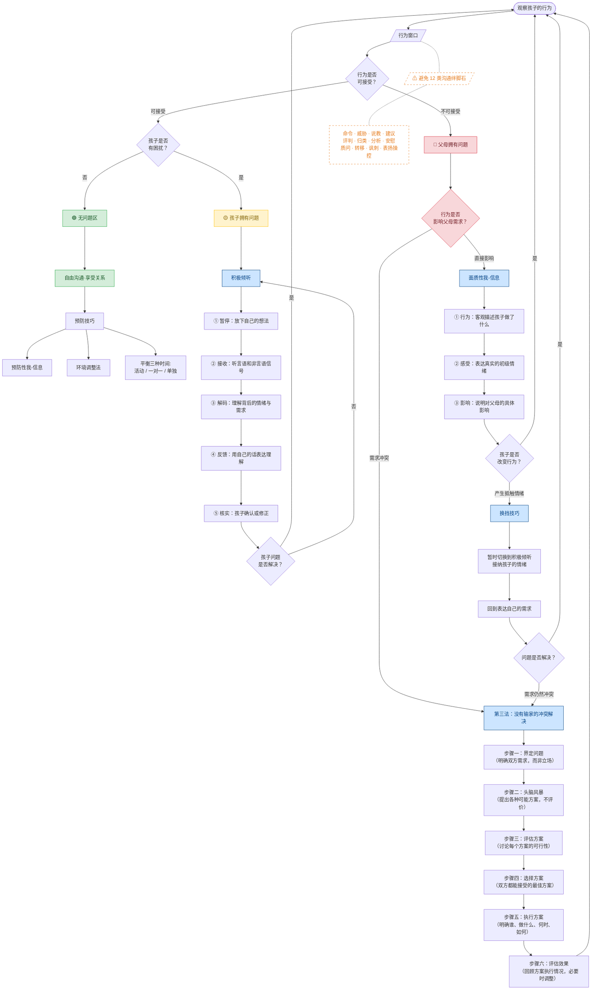

# PET 父母效能训练 · 工作流图

```mermaid
flowchart TD
    Start([观察孩子的行为]) --> BW[/行为窗口/]
    BW --> Accept{行为是否<br>可接受？}

    Accept -->|可接受| NP{孩子是否<br>有困扰？}
    Accept -->|不可接受| PO[🔴 父母拥有问题]

    NP -->|是| CO[🟡 孩子拥有问题]
    NP -->|否| NoProblem[🟢 无问题区]

    %% ───────── 无问题区 ─────────
    NoProblem --> Enjoy[自由沟通·享受关系]
    Enjoy --> Prevent[预防技巧]
    Prevent --> P1[预防性我-信息]
    Prevent --> P2[环境调整法]
    Prevent --> P3[平衡三种时间:<br>活动 / 一对一 / 单独]

    %% ───────── 孩子拥有问题 ─────────
    CO --> AL[积极倾听]
    AL --> AL1["① 暂停：放下自己的想法"]
    AL1 --> AL2["② 接收：听言语和非言语信号"]
    AL2 --> AL3["③ 解码：理解背后的情绪与需求"]
    AL3 --> AL4["④ 反馈：用自己的话表达理解"]
    AL4 --> AL5["⑤ 核实：孩子确认或修正"]
    AL5 --> ALResult{孩子问题<br>是否解决？}
    ALResult -->|是| Start
    ALResult -->|否| AL

    %% ───────── 父母拥有问题 ─────────
    PO --> Confront{行为是否<br>影响父母需求？}
    Confront -->|直接影响| IM[面质性我-信息]
    Confront -->|需求冲突| M3[第三法：没有输家的冲突解决]

    %% ─── 面质性我-信息 ───
    IM --> IM1["① 行为：客观描述孩子做了什么"]
    IM1 --> IM2["② 感受：表达真实的初级情绪"]
    IM2 --> IM3["③ 影响：说明对父母的具体影响"]
    IM3 --> IMResult{孩子是否<br>改变行为？}
    IMResult -->|是| Start
    IMResult -->|产生抵触情绪| Shift[换挡技巧]

    Shift --> ShiftAL[暂时切换到积极倾听<br>接纳孩子的情绪]
    ShiftAL --> ShiftBack[回到表达自己的需求]
    ShiftBack --> IMResult2{问题是否解决？}
    IMResult2 -->|是| Start
    IMResult2 -->|需求仍然冲突| M3

    %% ─── 第三法六步骤 ───
    M3 --> S1["步骤一：界定问题<br>（明确双方需求，而非立场）"]
    S1 --> S2["步骤二：头脑风暴<br>（提出各种可能方案，不评价）"]
    S2 --> S3["步骤三：评估方案<br>（讨论每个方案的可行性）"]
    S3 --> S4["步骤四：选择方案<br>（双方都能接受的最佳方案）"]
    S4 --> S5["步骤五：执行方案<br>（明确谁、做什么、何时、如何）"]
    S5 --> S6["步骤六：评估效果<br>（回顾方案执行情况，必要时调整）"]
    S6 --> Start

    %% ───────── 避免的沟通方式 ─────────
    BW -.- Avoid[/⚠ 避免 12 类沟通绊脚石/]
    Avoid -.- AvoidList["命令 · 威胁 · 说教 · 建议<br>评判 · 归类 · 分析 · 安慰<br>质问 · 转移 · 讽刺 · 表扬操控"]

    %% ───────── 样式 ─────────
    classDef green fill:#d4edda,stroke:#28a745,color:#155724
    classDef yellow fill:#fff3cd,stroke:#ffc107,color:#856404
    classDef red fill:#f8d7da,stroke:#dc3545,color:#721c24
    classDef tool fill:#cce5ff,stroke:#004085,color:#004085
    classDef warn fill:#fff,stroke:#e67e22,color:#e67e22,stroke-dasharray:5

    class NoProblem,Enjoy green
    class CO,AL yellow
    class PO,Confront red
    class IM,M3,AL,Shift tool
    class Avoid,AvoidList warn
```

> **核心原则**：先判断「行为窗口」→ 再确定「问题归属」→ 选择对应工具 → 灵活运用「换挡」→ 持续练习与自评
