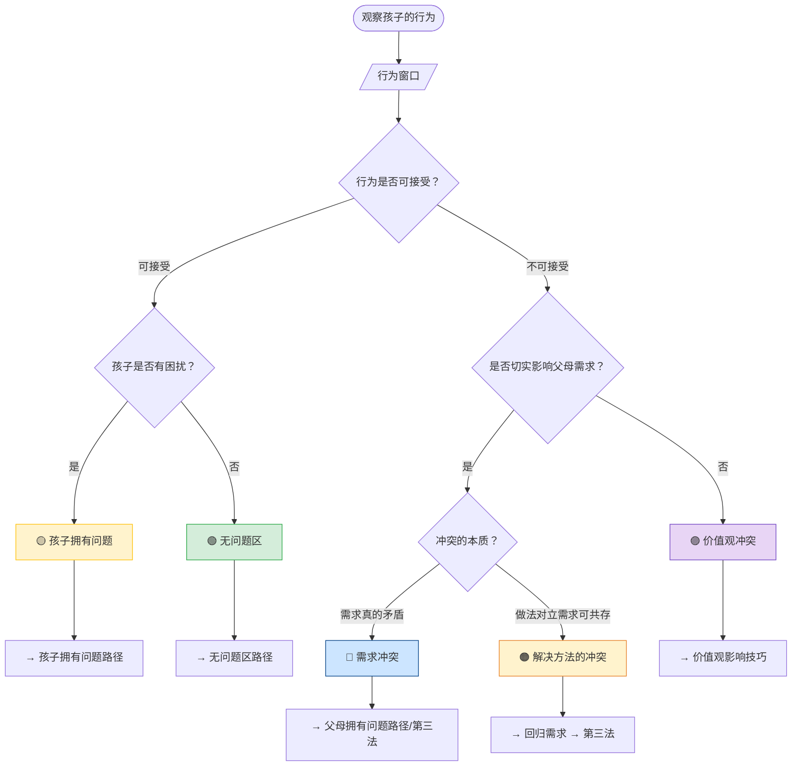

## 定义

从「观察孩子行为」到「选择对应工具」的完整决策路径。PET 的起点是 [[行为窗口]]：先判断行为是否可接受、问题归属于谁，再进入对应路径。

## 总流程图

## 关键步骤摘要

1. **观察行为**：客观描述孩子做了什么（事实，非评判）。
2. **行为窗口**：这个行为对我而言可接受吗？（真实感受，见 [[接受感三因素模型]]）
3. **问题归属**：可接受时 → 孩子有困扰吗？不可接受时 → 是否切实影响我的需求？冲突本质是需求冲突、做法冲突还是价值观冲突？（见 [[冲突类型与路径]]）
4. **选路径**：无问题区 → 预防技巧；孩子拥有问题 → 积极倾听；父母拥有问题 → 面质我-信息 → 必要时换挡或第三法。
5. **全程避免**：[[12种沟通绊脚石]]（命令、威胁、说教、建议等）。

## 关键洞见

- 先判断「行为窗口」→ 再确定「问题归属」→ 选择对应工具 → 灵活运用「换挡」→ 持续练习与自评。
- 用错工具比不用更危险：拿第三法去改价值观，或拿权力解决需求冲突，都会适得其反。
- 完整图示与五种情境详解见：`pet工作流图.md`、`PET冲突解决流程.md`。
