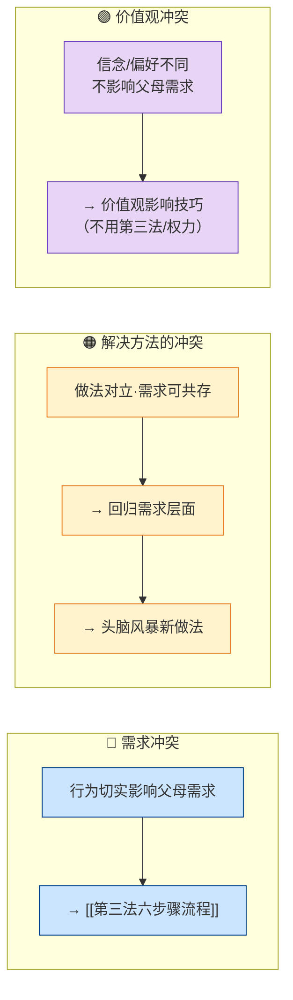

## 定义

当孩子的行为**不可接受**时，还需区分冲突的本质：**需求冲突**、**解决方法的冲突**、**价值观冲突**。类型不同，路径与工具不同；用错工具会适得其反。

## 三种冲突与对应路径

## 判断与路径摘要

| 类型 | 判断要点 | 核心路径 |
|------|----------|----------|
| **需求冲突** | 一方的行为切实、具体地影响另一方满足需求 | 面质我-信息 → 换挡（若有情绪）→ [[第三法（没有输家的冲突解决）]] 六步骤 |
| **解决方法的冲突** | 表面各执一个做法（你要 A 我要 B），但**底层需求可以同时满足** | 先问「我/孩子真正需要的是什么？」→ 回归需求 → 再头脑风暴满足双方需求的新做法；多数表面冲突属此类 |
| **价值观冲突** | 分歧在信念、偏好、风格，但行为**没有切实影响**父母需求 | 不用第三法、不用权力；用价值观影响技巧（榜样、顾问、我-信息+倾听等），见 [[价值观冲突]] |

## 关键洞见

- **分清「需求」和「做法」**是打开死锁的钥匙。当你发现自己在想「孩子必须……」时，问：「我真正需要的是什么？」
- 大多数表面冲突是**解决方法的冲突**，而非真正的需求冲突；先回归需求再谈做法，常能快速找到创造性方案。
- 价值观冲突：孩子行为未切实影响父母时，用权力或第三法强改价值观会损害关系；应尊重差异、用影响而非控制。
- 完整五种情境对比与价值观七等级见：`PET冲突解决流程.md` 第四、五、六节。
