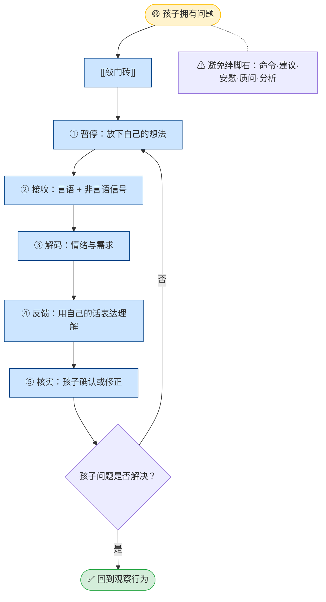

## 定义

当孩子的行为可接受，但**孩子自身**不高兴、沮丧、困惑、受伤时，问题属于孩子。此路径描述如何用 [[积极倾听]] 帮助孩子自己解决问题，而不替孩子解决、不给建议、不评判。

## 流程

## 关键步骤摘要

1. **敲门砖**：用「想说说看吗？」等打开沟通大门，非语言传达关注。
2. **暂停**：放下「我要帮他解决」的念头，全身心关注孩子。
3. **接收**：听言语内容，观察表情、语气、姿态。
4. **解码**：理解话语背后的情绪和需求。
5. **反馈**：用自己的话表达理解（常以「你」开头），不是鹦鹉学舌。
6. **核实**：孩子确认或修正，形成理解闭环；未解决则继续倾听。

## 关键洞见

- 信任孩子有能力处理自己的问题；情绪被接纳后，理性思考能力会回来。
- 最常见错误：先积极倾听两句，中途掉进绊脚石（建议、评判、说教）。
- 完整五步详解与必备态度见：`PET冲突解决流程.md` 第二节、[[积极倾听]]。
