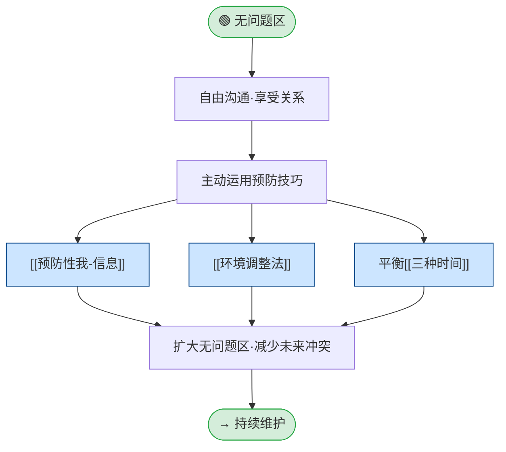

## 定义

当孩子的行为可接受、孩子自身也没有困扰时，双方需求都被满足，处于**无问题区**。此路径描述在该区域内如何主动巩固关系、减少未来冲突。

## 流程

## 关键步骤摘要

1. **享受关系**：轻松对话、不带目的地陪伴、建立情感银行存款。
2. **预防性我-信息**：提前告知自己的计划和需求，给孩子体谅的机会；一条及时的我-信息可以省去九次对抗。
3. **环境调整法**：改变环境而非改变孩子（丰富/简化/限制/安全/替代/预告等）。
4. **平衡三种时间**：活动时间、一对一时间、单独时间；失衡易引发问题和冲突。
5. **效果**：减少不可接受行为的发生，扩大行为窗口的无问题区。

## 关键洞见

- 无问题区不是「什么都不做」——是**主动投资关系**的最佳时机。
- 预防的成本远低于事后解决冲突；环境调整是最被忽视的预防手段。
- 完整子图与案例见：`PET冲突解决流程.md` 第一节。
