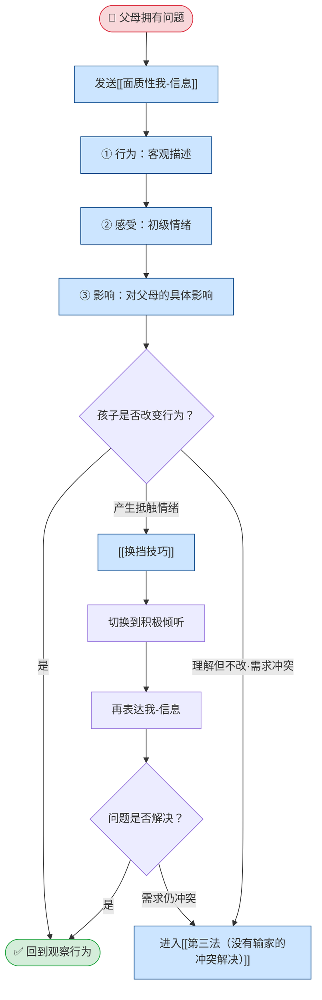

## 定义

当孩子的行为**不可接受**且**切实影响**父母满足自身需求时，问题属于父母。此路径描述：先发面质性我-信息，视孩子反应决定是否换挡或进入第三法。

## 流程

## 关键步骤摘要

1. **面质性我-信息**：行为（客观描述）+ 感受（真实初级情绪）+ 影响（对父母的具体影响）。
2. **看反应**：孩子主动改变 → 结束；产生情绪 → 换挡；理解但不改且确有需求冲突 → 第三法。
3. **换挡**：暂时切换到积极倾听，接纳孩子情绪，缓和后再回到表达自己的需求。
4. **第三法**：双方需求都重要且无法单方让步时，走 [[第三法六步骤流程]]。

## 关键洞见

- 先判断「是否切实影响父母需求」——若只是信念/偏好不同，见 [[冲突类型与路径]]（价值观冲突）。
- 面质后孩子有情绪是常态；换挡不是放弃需求，是先接住情绪再继续沟通。
- 完整需求冲突与换挡细节见：`PET冲突解决流程.md` 第三节。
