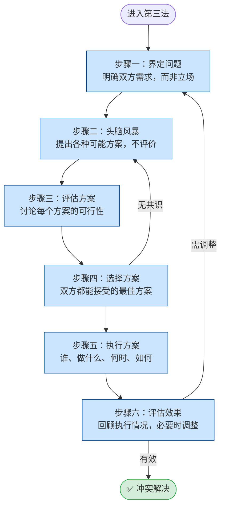

## 定义

当**需求冲突**明确（双方需求都重要、无法单方让步），且面质与换挡未能自然化解时，进入第三法。此卡片从**流程顺序**呈现六步骤的衔接；概念与细节见 [[第三法六步骤]]。

## 流程

## 关键步骤摘要

1. **界定问题**：父母用我-信息说明需求，用积极倾听了解孩子需求；聚焦**需求**而非预设解决方案。
2. **头脑风暴**：双方自由提出方案，此阶段不评价；先让孩子提，数量优先。
3. **评估方案**：逐一讨论可行性，「你能接受这个方案吗？」淘汰任一方无法接受的。
4. **选择方案**：选双方都真心接受的；无共识则回到步骤二。
5. **执行方案**：明确谁做什么、何时、如何；复杂可写下来。
6. **评估效果**：约定时间回顾；效果不好则回到步骤一重新界定，而非视为失败。

## 关键洞见

- 第三法适用于**需求冲突**，不适用于价值观冲突；前置通常是面质我-信息与换挡。
- 步骤一混淆「需求」与「做法」是常见失败原因，见 [[需求与解决方法的区别]]。
- 完整步骤说明与第三法优势见：[[第三法六步骤]]、`PET冲突解决流程.md` 第三节。
